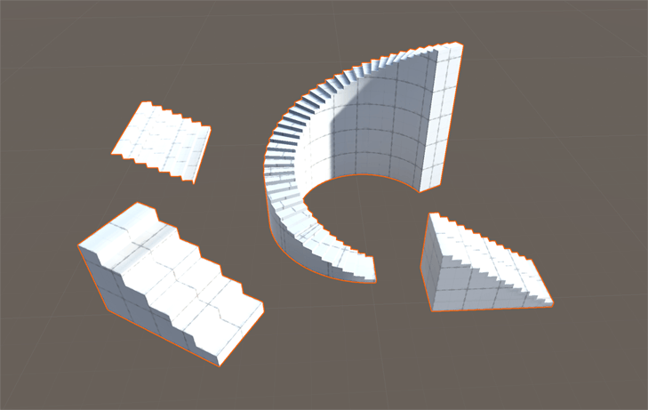
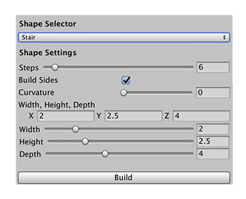

# Stair
You can create straight stairs, curved stairs, long stairs, stairs with a lot of steps, wide stairs, and stairs without side polygons.

You can customize the shape of your stairs with these shape properties:

| **Property:** | **Description:** |
|:-- |:-- |
| __Steps__ | Set the number of steps to define on the stairs. The default value is 6. Valid values range from 2 to 64. |
| __Build Sides__ | Enable this option to draw polygons on the sides of the stairs. This is enabled by default. You can disable this option if the sides of your stairs are not visible to the camera (for example, if your stairs are built into a wall). |
| __Curvature__ | Set the degree of curvature on the stairs, where 0 makes straight stairs and 360 makes stairs in a complete circle. Keep in mind that you might need to increase the number of stairs to compensate as you increase this value. The default value is 0. Valid values range from 0 to 360. |
| __Width__ or __X__ | Set the width (dimensions in the x-axis) of the stairs. You can use the __Width__ slider or enter an exact value in the __X__ text box. The default value is 2. Valid values range from 0.01 to 10. |
| __Height__ or __Y__ | Set the height (dimensions in the y-axis) of the stairs. You can use the __Height__ slider or enter an exact value in the __Y__ text box. The default value is 2.5. Keep in mind that you may need to increase the number of stairs to compensate as you increase this value. Valid values range from 0.01 to 10. |
| __Depth__ or __Z__ | Set the depth (dimensions in the z-axis) of the stairs. You can use the __Depth__ slider or enter an exact value in the __Z__ text box. Keep in mind that you may need to increase the number of stairs to compensate as you increase this value. The default value is 4. Valid values range from 0.01 to 10. |
