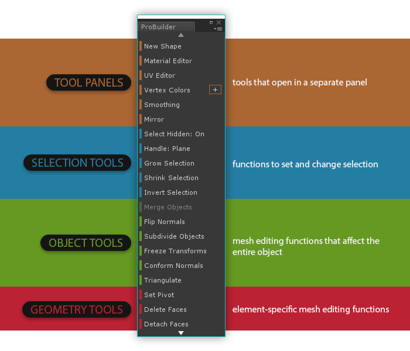
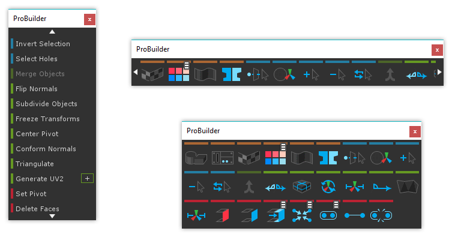

<!-- # Video: Toolbar Overview -->
<!--  -->

ProBuilder is controlled via the **Main Toolbar**, which contains all commonly used functions.

A second toolbar, the **Edit Mode Toolbar**, is available to quickly switch between editing modes. This toolbar can always be found floating at the top-middle of your currently active scene view.

---

### Tool Categories

Section Video: <a href="@todo">Toolbar Overview: Categories</a>

The Toolbar is color-coded to help you quickly choose tools by type:

* **Orange** for [Tool Panels](tool-panels)
* **Blue** for [Selection Tools](selection-tools)
* **Green** for [Object Actions](object-actions)
* **Red** for Geometry Actions ([Vertex](vertex), [Edge](edge), [Face](face))

---

### Resizing and Text vs Icon Mode

Section Video: <a href="@todo">Toolbar Overview: Text vs Icon Mode</a>

You can resize the Toolbar however you like; ProBuilder will re-order the icon or text contents to best fit the window size.

Prefer the good ol' Text Buttons? Right click on the toolbar in the empty space and choose "Use Text Mode".  In this menu you can also change how this window is displayed (docking or floating).

---

### Dynamic Layout

Section Video: <a href="@todo">Toolbar Overview: Dynamic Layout</a>

This is a "smart" toolbar, and dynamically changes to match your current editing method and selection.

* Buttons are only shown on the Toolbar if they are applicable in your current editing mode
* Buttons that cannot be used on the current selection are automatically grayed-out and disabled.

---

### Custom Settings for Actions

Section Video: <a href="@todo">Toolbar Overview: Custom Settings for Actions</a>

Some of the most-used actions ([Extrude](face/#extrude), [Collapse](vertex/#collapse), [Grow Selection](selection-tools/#grow), etc) also include Custom Settings, which can significantly modify the action.

 This symbol is shown next to a button if there are Custom Settings available. To edit these settings, `ALT CLICK` on the button.

When using the text toolbar the options menu for actions is shown as a `+` icon to the right.  Simply click the icon to open the options window.

---

### Edit Mode Toolbar

Section Video: <a href="@todo">Toolbar Overview: The Edit Mode Toolbar</a>

This toolbar switches ProBuilder between the available edit modes.

By default it is in the Top Middle of the Scene View, but you may change where this toolbar is positioned in the `Preferences > ProBuilder` panel.

Use this toolbar to choose your Edit Mode, or use keyboard shortcuts:

* `Escape` to exit back to Object mode
* `G` to toggle in/out of the Geometry editing modes
* `H` to toggle through the available Element modes (Vertex, Edge, and Face)

If you prefer to have dedicated keys for each mode (ex, `J` opens `Vertex Mode`, `K` opens `Face Mode`, etc) you can enable "Unique Mode Shortcuts" in the Preferences window.
