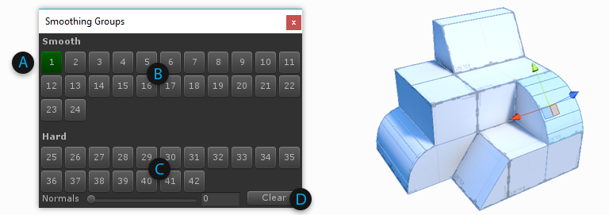

<!-- # Video: Tool Panels -->
<!--  -->

These **Tool Panels** contain important tools for [Shape Creation](#shape-tool), [Materials](#material-tools), [Texturing and UVs](#texturing), [Vertex Coloring](#vertex-colors), and [Smoothing Groups](#smoothing-groups).

**Note:** Each panel can be docked, kept floating, or simply closed immediately after use.

---

---

## Shape Tool

Section Video: <a href="@todo link vid section">ProBuilder Toolbar: Shape Tool</a>

**Keyboard Shortcut** : `CTRL SHIFT K`

**Purpose** : Create new editable shapes such as Cylinder, Arch, and Stairs.

Each shape has specific properties which can be customized before creation- for example, the Stairs shape lets you choose items like Step Height, Arc, and which parts of the Stairway to build.

**Usage** : To create a new shape, do the following:

1. Open the New Shape Tool
1. If "Shape Preview" is enabled, you will see a blue Preview Object in the scene
1. Choose the Shape you'd like to create (ex, Cube, Cylinder, Torus, etc)
1. Set the options (ex, width, height, radius, number of stairs, etc)
1. You may Move or Rotate the Preview Object within your scene
1. Once ready, click "Build Shape" to create your final Shape

---

## Material Tools

Section Video: <a href="@todo link vid section">ProBuilder Toolbar: Material Tools</a>
 
Related Video: <a href="@todo link vid section">Texturing and UVs</a>

**Purpose** : Save and apply your most frequently used materials, using Quick Material one-click or Material Palette keyboard shortcuts.

**Quick Material Usage**:

* **(A)** The current "Quick Material"
* **(B)** Apply the Quick Material to the selected faces
* **(C)** Pick your Quick Material from the selected face
* **(D)** Preview of the current Quick Material

Hold `CTRL SHIFT` while clicking on a face to apply the Quick Material.

**Material Palette Usage** :

* **(E)** Drag-and-drop your often-used materials to these slots
* **(F)** Create additional Material Palette slots

You can also press `ALT (number key)` to apply materials from the Palette.

---

## Texturing and UVs

Section Video: <a href="@todo link vid section">ProBuilder Toolbar: Texturing and UVs</a>

**Purpose** : Opens the UV Editor Panel, for controlling how materials are displayed on your mesh (tiling, offset, unwrapping, etc).

The UV Editor Panel includes both [Auto UV](../texturing/auto-uvs-actions) tools, and a complete [Manual UV Editing and Unwrapping](../texturing/manual-uvs-actions) system.

*More Info: [**Texturing and UVs**](../texturing/overview-texture-mapping)*

---

## Vertex Color Tools

Section Video: <a href="@todo link vid section">ProBuilder Toolbar: Vertex Color Tools</a>

**Purpose** : Opens the Vertex Coloring controls, for applying or painting vertex colors onto meshes.

<strong>Warning!</strong>  Not all shaders will show vertex colors on a mesh.
<!--   See <a href="@todo">Vertex Colors FAQ</a> for more information. -->

Applying Vertex Colors is a great way to colorize levels for prototyping, team layout, zones, etc.

<!-- *More Info: [**Vertex Coloring**](@todo)*  -->

---

## Smoothing Groups

Section Video: <a href="@todo link vid section">ProBuilder Toolbar: Smoothing Groups</a>

**Purpose**: Create a smooth and rounded look, or sharp-edged and faceted.

**Usage**:

- Choose Face editing from the [Edit Mode Toolbar](../toolbar/overview-toolbar/#edit-mode-toolbar)
- Select a group of faces that you want to be smooth
	- *If no faces are selected, or you are in [Object Mode](@todo), any Smoothing actions will be applied to the entire object*
- **(A)** If any selected faces already have Smoothing Groups assigned, they will be highlighted. Clicking on a highlighted group will un-assign it.
- **(B)** To assign the selected faces to a new Smoothing Group, click any available group button
- **(C)** You can also assign Hard groups
- **(D)** Press the "Clear" button to clear all Smoothing from the selected faces
